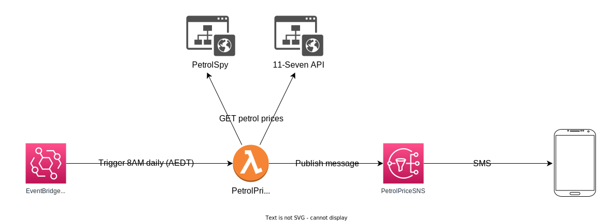

# Petrol Price Notifier ⛽️

Daily cron job that fetches the lowest, nearby petrol prices for the day and sends it to my phone via an SMS message.

## Technology 🛠️

- [Kotlin](https://kotlinlang.org/)
- [Gradle](https://gradle.org/)
- [Jsoup](https://jsoup.org/)
- [GitHub Actions](https://github.com/features/actions)
- [AWS Lambda](https://aws.amazon.com/lambda/features/)
- [AWS EventBridge](https://aws.amazon.com/eventbridge/features/)
- [AWS Simple Notification Service (SNS)](https://aws.amazon.com/sns/features/)
- [AWS Cloudformation](https://aws.amazon.com/cloudformation/features/)

## Architecture 🏛️

The project was undertaken to explore the feasability and deployment of a simple cron job using the AWS stack.

## Handling partial failures 🚫

The cron job may experience intermittent connection issues with [Petrol Spy](https://petrolspy.com.au/) and as a result, is unable to retrieve the petrol price from there. When this happens, a default value of `N/A` is populated in the final message. This allows the job to always publish a message and not fail the job entirely.

## Testing 🧪

[JUnit](https://junit.org/junit5/) and [Mockk](https://mockk.io/) were used to write unit tests. Tests follow a simple hierarchy where each test is named `[ClassToTest]Test.kt` with nested inner classes dedicated to a single method for that class.

## CI/CD Pipeline ⏩

[CI/CD pipeline](https://github.com/nixonsu/petrol-price-notifier/actions/workflows/pipeline.yaml) is used to automate tests, package and deploy to production when pushed to `main`.

## Future Considerations
Currently, in order to subscribe to receive the SMS message, I have to manually create a subscription for a phone number via the AWS console. In the future, I want to explore achieving this feature via a proper UI or API endpoint and using AWS SDK to subscribe the user's phone number.

## Sources 📘

- [11-Seven API](https://projectzerothree.info/api.html)
- [Petrol Spy](https://petrolspy.com.au/)
